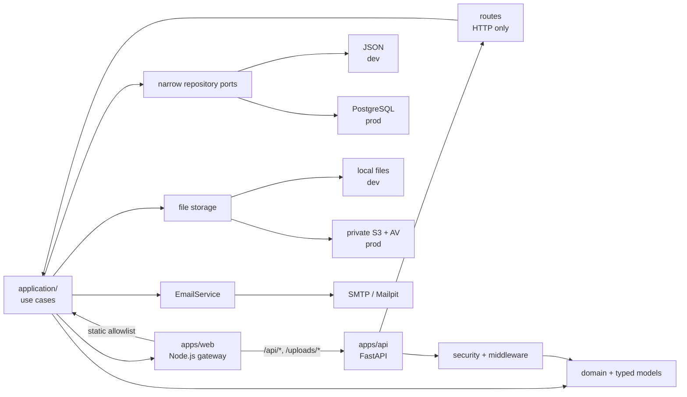
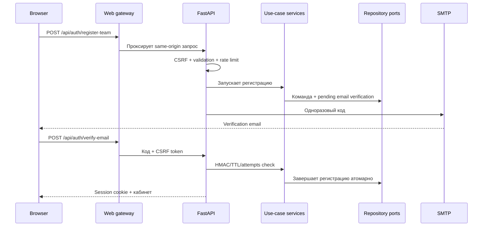

# Архитектура «Лучшая учебная группа»

## Целевая схема

```text
Browser
  │ same-origin HTTPS
  ▼
CDN / WAF / DDoS edge
  │ origin закрыт firewall-правилом
  ▼
Nginx :443 ── TLS, edge limits, health access ──┐
                                                ▼
apps/web :4173  ── static UI + reverse proxy ──┐
                                                ▼
                                          apps/api :4174
                                                │
             ┌──────────────────────────────────┼────────────────────────┐
             ▼                                  ▼                        ▼
        domain/routes                       PostgreSQL              private object storage
        auth/admin/user/profile/notifications + Redis                + AV/async scan
                                                + SMTP email delivery
```

В локальном контуре `npm start` поднимает оба процесса на loopback. В production web и API можно масштабировать отдельно: web остаётся лёгким edge/gateway-слоем, API запускается несколькими stateless-инстансами за балансировщиком.
Nginx является внешним TLS/limit-слоем для публичного контура; он не должен проксировать запросы напрямую в FastAPI, потому что CSRF-cookie, allowlist маршрутов и внутренний operations-token обрабатываются web gateway.

### Runtime-поток запроса



### Регистрация команды



Восстановление пароля использует отдельное временное состояние
`passwordResets`: код отправляется на подтверждённый email, хранится только
как HMAC, а после успешной проверки пароль меняется через `Argon2id` и все
активные сессии пользователя отзываются. Организаторские решения пишутся в
уведомления участника и параллельно отправляются подтверждённым адресатам по
SMTP с ограниченной конкурентностью.

## Границы каталогов

```text
apps/web/
  public/pages/           HTML-страницы конкурса
  public/css/             стили конкурса
  public/js/              браузерные модули конкурса
  public/fonts/           шрифты конкурса
  public/assets/          SVG и прочие визуальные ресурсы
  src/static.js           allowlist статических путей и безопасная раздача
  src/server.js           web gateway, CSRF-cookie, proxy, web health/metrics

apps/api/
  app/main.py              FastAPI composition root, lifecycle и middleware
  app/application/         use-case services, typed commands and narrow repository ports
  app/routes/               тонкий HTTP boundary: auth, registration, profile, notifications и admin
  app/shared/               доменные правила и organizer projections
  app/security/             cookies, CSRF, password/session, RBAC, rate limiting
  app/infrastructure/       PostgreSQL/JSON repository adapters и local/S3 file storage
  app/http/                 body limits, security headers, request IDs
  app/observability.py      structured logs, counters, Prometheus metrics
  requirements.txt          runtime-зависимости FastAPI/asyncpg/Redis/S3/OTel

packages/shared/           transport helpers без привязки к конкретному приложению
packages/contracts/        OpenAPI JSON single source of truth и API portal contract
tests/smoke.mjs            сквозная проверка основных сценариев
```

### Почему web и API разделены

- Статические ресурсы не импортируют серверное состояние и могут обслуживаться CDN.
- API не знает о HTML-маршрутизации и может масштабироваться независимо.
- Nginx принимает внешний HTTPS-трафик и передаёт его только в web gateway; web gateway остаётся единственной точкой доступа к API.
- Внутренние маршруты API недоступны через неявную раздачу файлов: web проксирует только allowlisted-префиксы.
- API-контракт опубликован отдельно и отображается в `/api.html`, поэтому потребители могут проверять endpoints без чтения монолита.

## Persistence и масштабирование

В development по умолчанию используется совместимый `data/lug.json` с атомарной записью через временный файл. Это переходный single-process adapter; production use cases работают через узкие repository ports и не зависят от JSON state.

Для production:

1. `LUG_DATABASE_PROVIDER=postgres` + `LUG_DATABASE_URL` переключают API на нормализованный async PostgreSQL adapter. Таблицы пользователей, команд, достижений, уведомлений, сессий, загрузок, email-verifications, password-resets и аудита имеют отдельные строки и индексы по ключевым связям. Ключевые поля сущностей (идентификаторы, связи, статусы, поисковые поля, размеры и timestamps) читаются из canonical SQL columns; `payload` оставлен только как compatibility/extension JSONB. Схема подготавливается отдельным migration job до запуска API, runtime проверяет только стабильные capability tables, а не конкретный revision. Запись изменяет только затронутые сущности, поэтому независимые мутации не блокируют весь API. HTTP routes вызывают use cases через repository ports и не загружают глобальный `DatabaseState`.
2. Сессии и данные должны жить в общем PostgreSQL/Redis-контуре, а rate limiting при наличии `REDIS_URL` автоматически использует Redis. При включённом trust proxy требуется явно задать `LUG_TRUSTED_PROXY_IPS`.
3. `LUG_FILE_STORAGE_PROVIDER=s3` включает private S3-compatible adapter: файл проходит те же MIME/magic/AV-проверки, загружается в bucket с непредсказуемым ключом, а после BOLA-проверки API выдаёт presigned GET URL на 5 минут. Multipart intents хранятся в Redis с TTL, поэтому complete-запрос может попасть на другую API-реплику или пережить рестарт процесса. `LUG_S3_ENDPOINT_URL` поддерживает MinIO, Cloudflare R2 и другие S3-compatible providers. В production local adapter запрещён.
4. При создании PostgreSQL адаптер не выполняет DDL и миграции; retention audit log составляет 730 дней, а операции migration, backup/restore и одноразовый импорт `scripts/import-json-postgres.py` выполняются отдельным release/operations-процессом.

В development/test глобальный `DATABASE_URL` намеренно не выбирается автоматически:
нужен явный `LUG_DATABASE_PROVIDER=postgres` или `LUG_DATABASE_URL`. В production
PostgreSQL обязателен, поэтому `DATABASE_URL` допускается как стандартный DSN,
но запуск дополнительно fail-closed проверяет Redis, operations token и Host allowlist.

## Безопасность

- Новые пароли хешируются `Argon2id`; старые `scrypt`-хеши поддерживаются для обратной совместимости. В cookie хранится session token, а в persistent store — только его SHA-256 hash.
- Мутации требуют CSRF-токен из cookie и заголовка `X-CSRF-Token`.
- Авторизация и admin RBAC выполняются на API; UI не является источником прав.
- Приватные загрузки проверяются по владельцу, команде или роли администратора; статический сервер не раздаёт `uploads` напрямую.
- Тела JSON/upload ограничены потоковым чтением на API и лимитом на web gateway; для файлов проверяются размер, расширение, MIME, magic bytes и AV-сканирование до публикации.
- Включены `X-Content-Type-Options`, frame/referrer/permissions/cross-origin policies, CSP для UI и HSTS при secure cookies.
- Rate limiting разделён на login/register/invite lookup, загрузки и чувствительные действия; Redis позволяет синхронизировать лимиты между инстансами.
- `requestTimeout`, `headersTimeout`, `maxConnections`, keep-alive и `clientError` ограничивают дешёвые resource-exhaustion сценарии.
- Все запросы получают `X-Request-Id`; structured logs и `/metrics` с bounded histogram buckets пригодны для Loki/ELK/Prometheus/Grafana без бесконечного роста списков timings в памяти.
- Web gateway создаёт/пропускает W3C `traceparent`, API создаёт server spans через OpenTelemetry и при заданном OTLP endpoint экспортирует их через BatchSpanProcessor.
- Для реальной DDoS-защиты нужен внешний CDN/WAF: rate limiting API-процесса не заменяет edge-фильтрацию volumetric-атак.

## Quality gates

- Для Python-модулей API warning-порог составляет 350 строк, hard limit — 500; transitional JSON compatibility command явно исключён до его удаления. Composition root ограничен 300 строками, web-модули — 220 строками, root launcher — 140 строками.
- `apps/web/public` не содержит HTML и шрифты вперемешку: страницы находятся в `pages/`, шрифты — в `fonts/`, доступ к статике идёт через allowlist.
- `npm run check` включает `npm run quality`; форматирование и lint API выполняются командами `ruff format apps/api/app` и `ruff check apps/api/app`.
- CSS/JS страниц конкурса остаются отдельными статическими дизайн-артефактами: их размер не смешан с серверной архитектурой, чтобы сохранить визуальную совместимость.

## API и доменные модули

- `auth`: login/logout по email, регистрация команды, присоединение по инвайту, email verification code, восстановление пароля и session endpoint.
- `profile`: изменение личных данных и повторная загрузка фото личного кабинета; после успешной замены администраторам добавляется уведомление.
- `teams`: команда, captain, invitations с TTL/revoke и серверной квотой 60%.
- `portfolio`: достижения, файлы, deadline window и статусы проверки.
- `review`: identity, scoring, decisions, comments и audit log.
- `video`: загрузка и модерация видео по четырём критериям.
- `notifications`: адресация `all/team/captain/user`, unread/read state, email-копии подтверждённым адресатам и bounded concurrency для рассылки.
- `content`: редактируемые организатором сроки, тексты и публичные результаты.
- `admin`: overview, audit, quota, team/member/identity/achievement/video review, settings и broadcast.

Полный список текущих методов и paths — в `packages/contracts/openapi.json`, единственном источнике API-контракта.

## Совместимость интерфейса

Страницы `index.html`, `cabinet.html`, `admin.html`, `privacy.html`, `register.html`, `results.html` и `rules.html`, их CSS, JS и assets перенесены в `apps/web/public` без визуального переписывания. `js/store.js` остался HTTP-клиентом; правила, сессии и дедлайны находятся в API-модулях. Визуальный baseline правил совпал с результатом после рефакторинга побитно; smoke и browser checks подтверждают загрузку главной страницы и API portal.

## Backup/restore JSON-режима

JSON-store предназначен только для single-instance development. Команда
`npm run backup` атомарно создаёт `data/lug-<timestamp>.json.gz` и удаляет
архивы старше `LUG_BACKUP_RETENTION_DAYS` (по умолчанию 7 дней). Restore принимает
только `.json.gz`, проверяет, что внутри JSON-объект, делает backup текущего
`lug.json`, затем атомарно заменяет его.

## Запуск и проверки

```powershell
$env:LUG_ADMIN_EMAIL = 'admin@example.com'
$env:LUG_ADMIN_PASSWORD = 'замените-на-свой-пароль'
$env:LUG_ADMIN_NAME = 'Оргкомитет ЛУГ'
npm install
npm run check
npm run test:smoke
npm start
```

Существующий bootstrap-администратор синхронизируется по email при явных `LUG_ADMIN_*`; старый `LUG_ADMIN_PHONE` используется только для одноразового поиска legacy-записи. При отсутствии этих переменных уже сохранённые данные не перезаписываются.

## Доменные статусы

`identityStatus`: `pending` → `approved` / `rejected`; портфолио можно подтверждать только после `approved`.

`videoStatus`: `none` → `pending` → `approved` / `rejected`.

`portfolio`: доступно в окне `portfolioStart`—`portfolioDeadline`, далее только просмотр. Видео принимается в окне `videoStart`—`videoDeadline`. Инвайт может быть активным, отозванным или просроченным.
