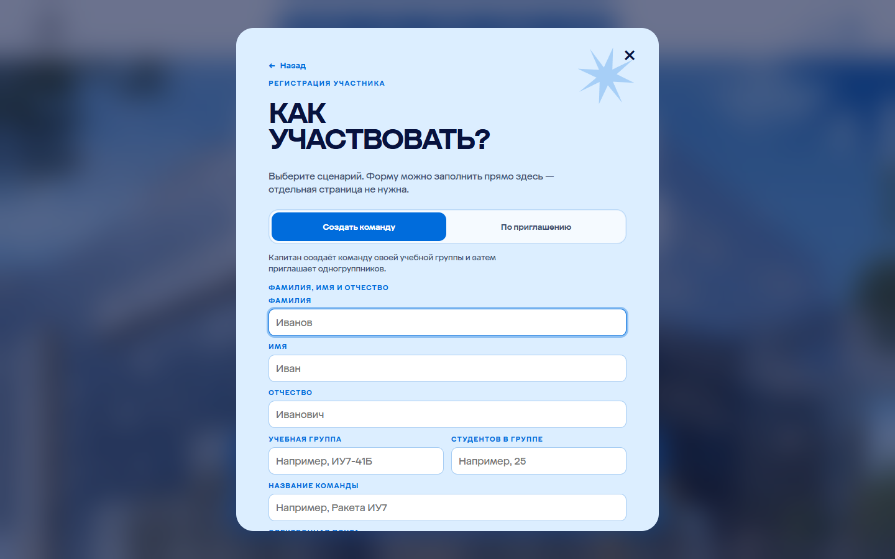
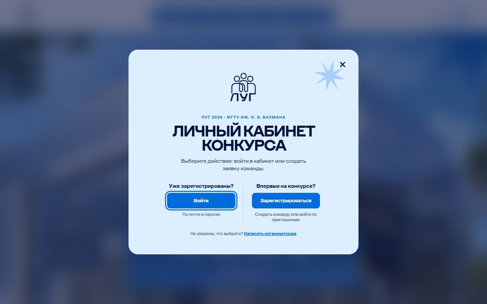
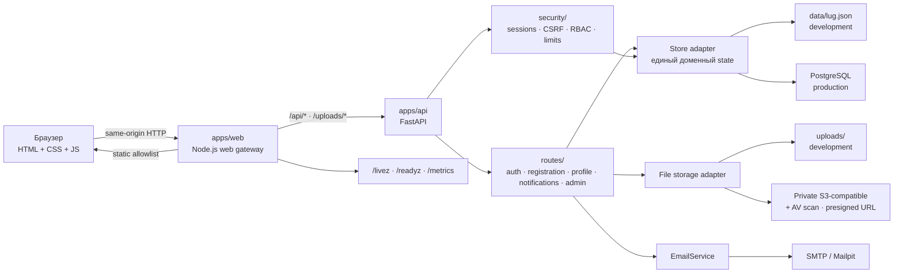
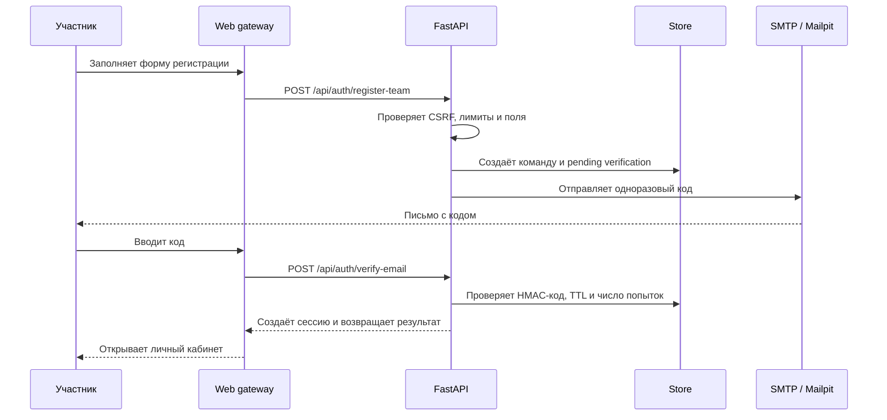

# ЛУГ 2026

Веб-платформа конкурса «Лучшая учебная группа» МГТУ им. Н. Э. Баумана. Проект объединяет публичную страницу конкурса, регистрацию команд, личный кабинет участника и рабочее место оргкомитета.

Интерфейс остаётся статическим и лёгким, а серверная часть разделена на web gateway и FastAPI API. Такое разделение позволяет независимо развивать UI, API и production-инфраструктуру, не превращая браузерный код в источник прав доступа.

## Содержание

- [Возможности](#возможности)
- [Визуальный обзор](#визуальный-обзор)
- [Как работает система](#как-работает-система)
- [Структура проекта](#структура-проекта)
- [Быстрый запуск](#быстрый-запуск)
- [Конфигурация](#конфигурация)
- [API и контракты](#api-и-контракты)
- [Безопасность](#безопасность)
- [Проверки](#проверки)
- [Production](#production)
- [Документация](#документация)

## Возможности

### Для участников

- регистрация команды капитаном или присоединение по приглашению;
- подтверждение email одноразовым кодом;
- вход по email и паролю с cookie-сессией;
- восстановление пароля по одноразовому коду из письма;
- личный кабинет команды и участников;
- редактирование профиля и повторная загрузка фото личного кабинета;
- заполнение профиля и портфолио по направлениям конкурса;
- загрузка файлов и видео с серверными квотами и проверками;
- просмотр сроков, статусов проверки и уведомлений;
- получение копий важных уведомлений на подтверждённый email.

### Для оргкомитета

- обзор команд, участников и заполненности материалов;
- проверка анкет, достижений и видео;
- управление сроками, текстами, квотами и приглашениями;
- аудит действий и операционные метрики;
- публичная публикация результатов.

### Для эксплуатации

- запуск без внешней БД в development через JSON store;
- PostgreSQL, Redis и private S3-compatible storage для production;
- SMTP-доставка кодов, восстановления пароля и уведомлений участникам;
- Mailpit для локального тестирования писем;
- health/readiness/metrics endpoints;
- ограничение размеров запросов, таймауты, rate limiting, CSP и security headers;
- OpenAPI-контракт, smoke-тест и отдельные проверки SMTP.

## Визуальный обзор

Публичная страница использует единый визуальный язык: светло-голубой фон, насыщенный синий, тёмно-синий текст, крупную типографику, пунктирные линии и фирменные звёзды.


<table>
  <tr>
    <td></td>
    <td></td>
  </tr>
  <tr>
    <td align="center">Регистрация команды</td>
    <td align="center">Вход участника</td>
  </tr>
</table>

Скриншоты сохранены в `docs/screenshots/` и не требуют доступа к внешнему хостингу, поэтому README корректно отображается и в GitHub, и в локальной копии.

## Как работает система

### Runtime-схема



`apps/web` — единственная публичная точка входа в API в штатной схеме. Он раздаёт только разрешённые статические пути, выпускает CSRF-cookie, ограничивает размер проксируемого тела и передаёт запросы в FastAPI. Сам API отдельно проверяет CSRF, сессию, роль и доступ к объекту.

### Поток регистрации и подтверждения email



Для незавершённой регистрации повторная отправка формы обновляет существующий код и заявку, поэтому пользователь не получает ложный конфликт «код уже отправлен». Восстановление пароля использует отдельный одноразовый код с тем же SMTP-каналом и после успешной смены пароля завершает активные сессии.

Организаторские решения и изменения статусов сохраняются как уведомления в личном кабинете и дополнительно отправляются подтверждённым адресатам по SMTP. При редактировании профиля участник может заменить фото личного кабинета: новый файл снова проходит проверку формата, содержимого и антивирусную проверку, старый объект удаляется после успешной замены, а администраторам создаётся уведомление о новом фото.

Код подтверждения не хранится в открытом виде: приложение использует HMAC-секрет, срок действия, cooldown повторной отправки и лимит неверных попыток. Для staging и production секрет и SMTP-параметры должны приходить только из secret manager или защищённых переменных окружения.

### Связи модулей

| Слой | Главные пути | Ответственность |
| --- | --- | --- |
| Публичный UI | `apps/web/public/pages`, `css`, `js` | Страницы конкурса, кабинет, админка и API portal |
| Web gateway | `apps/web/src/server.js` | Static allowlist, CSRF-cookie, proxy, request IDs, timeouts |
| HTTP helpers | `apps/web/src/http.js`, `packages/shared/http.js` | Заголовки, cookies, trace context и общие transport helpers |
| API composition root | `apps/api/app/main.py`, `context.py` | FastAPI lifecycle, middleware, зависимости и bootstrap admin |
| Route handlers | `apps/api/app/routes/` | Auth, registration, password reset, profile, notifications, admin и operations |
| Security | `apps/api/app/security/` | Пароли, cookie sessions, CSRF, RBAC и rate limits |
| Domain | `apps/api/app/shared/`, `models.py` | Правила предметной области и response projections |
| Persistence | `apps/api/app/infrastructure/store.py`, `postgres.py` | JSON store в development и PostgreSQL в production |
| Files | `file_storage.py`, `s3_storage.py` | MIME/magic/AV checks, quotas, private files и signed URLs |
| Email | `apps/api/app/infrastructure/email.py` | Log, SMTP, коды, восстановление пароля и уведомления |
| Контракты | `packages/contracts/openapi.*` | Проверяемая граница между API и клиентами |

## Структура проекта

```text
apps/
├─ web/
│  ├─ public/
│  │  ├─ pages/            HTML-страницы
│  │  ├─ css/              стили
│  │  ├─ js/               браузерные модули
│  │  └─ assets/           логотипы, звёзды и изображения
│  ├─ src/                 gateway, static allowlist, HTTP и observability
│  └─ server.js            локальный launcher web-процесса
└─ api/
   ├─ app/
   │  ├─ routes/           HTTP endpoints
   │  ├─ security/         auth, CSRF, RBAC, rate limiting
   │  ├─ infrastructure/   store, PostgreSQL, files, S3, email
   │  ├─ shared/           domain rules и projections
   │  └─ main.py           FastAPI composition root
   └─ requirements.txt
packages/
├─ contracts/              OpenAPI JSON/YAML
└─ shared/                 общие JS transport helpers
tests/                     smoke и SMTP checks
scripts/                   quality, backup, restore и локальный Mailpit
deploy/                    Nginx, ClamAV и cloud-init примеры
docs/screenshots/          безопасные UI-скриншоты для документации
ARCHITECTURE.md            детальные архитектурные решения
DEPLOYMENT.md              production deployment runbook
SECURITY_REVIEW.md         результаты security review и остаточные риски
```

## Быстрый запуск

Нужны Node.js 20+ и Python 3.11+. Docker требуется только для локального Mailpit.

```powershell
npm install
python -m pip install -r apps/api/requirements.txt

$env:LUG_ADMIN_EMAIL = 'admin@example.com'
$env:LUG_ADMIN_PASSWORD = 'замените-на-свой-пароль'

npm start
```

Откройте [http://127.0.0.1:4173](http://127.0.0.1:4173). API portal находится на [http://127.0.0.1:4173/api.html](http://127.0.0.1:4173/api.html).

По умолчанию используется `LUG_EMAIL_MODE=log`: код подтверждения выводится только в локальный лог. Для полноценной локальной проверки письма:

```powershell
npm run start:local-mailpit
```

Mailpit будет доступен только на [http://127.0.0.1:8025](http://127.0.0.1:8025). Этот режим запускает web gateway на `:4173`, API на `:4174` и SMTP-приёмник на `127.0.0.1:1025`.

## Команды

```powershell
npm start                  # web :4173 + API :4174
npm run api                # только FastAPI
npm run web                # только web gateway
npm run quality            # лимиты размеров и архитектурные правила
npm run check              # quality + синтаксические проверки
npm run test:smoke         # auth, CSRF, uploads, API и UI smoke
npm run test:smtp-local    # SMTP delivery через локальный Mailpit
npm run backup             # gzip-backup JSON state с retention
```

Для восстановления JSON-backup:

```powershell
$env:LUG_DATA_DIR = 'data'
npm run restore:json -- data/lug-20260828T120000Z.json.gz
```

## Конфигурация

Локально достаточно `LUG_ADMIN_EMAIL` и `LUG_ADMIN_PASSWORD`. Остальные параметры имеют безопасные development defaults.

| Переменная | Назначение |
| --- | --- |
| `LUG_DATA_DIR` / `LUG_UPLOAD_DIR` | JSON state и локальные файлы |
| `LUG_DATABASE_PROVIDER=postgres` | Явно включает PostgreSQL adapter; в production обязателен |
| `LUG_DATABASE_URL` / `DATABASE_URL` | DSN PostgreSQL; в production отсутствие DSN останавливает запуск |
| `LUG_DATABASE_SSL_MODE` / `LUG_DATABASE_SSL_ROOT_CERT` | TLS PostgreSQL; в production только `verify-full` |
| `LUG_DATABASE_POOL_MIN_SIZE` / `LUG_DATABASE_POOL_MAX_SIZE` | Размер async-пула PostgreSQL между запросами |
| `REDIS_URL` | Общий rate limiter между API-инстансами |
| `LUG_FILE_STORAGE_PROVIDER=local\|s3` | Backend файлов; в production — `s3` |
| `LUG_S3_*` | Private bucket, endpoint, credentials и prefix |
| `LUG_S3_SERVER_SIDE_ENCRYPTION` / `LUG_S3_KMS_KEY_ID` | Обязательное SSE для S3 (`AES256` или `aws:kms`) |
| `LUG_UPLOAD_SCAN_COMMAND` / `LUG_UPLOAD_SCAN_REQUIRED` | ClamAV/совместимый сканер и fail-closed режим |
| `LUG_EMAIL_MODE=log\|smtp` | Лог или SMTP-доставка кодов подтверждения и писем капитанам |
| `LUG_SMTP_*` | SMTP host, port, user, password, sender и TLS |
| `LUG_EMAIL_VERIFICATION_TTL_MS`, `LUG_EMAIL_VERIFICATION_COOLDOWN_MS`, `LUG_EMAIL_VERIFICATION_MAX_ATTEMPTS` | Срок жизни, повторная отправка и число попыток email-кодов |
| `LUG_MAX_UPLOADS_PER_USER`, `LUG_MAX_UPLOAD_BYTES_PER_USER` | Квоты количества и суммарного размера файлов на участника |
| `LUG_EMAIL_VERIFICATION_SECRET` | HMAC-секрет кодов; в staging/production минимум 32 символа |
| `LUG_EMAIL_OUTBOX_ENCRYPTION_KEY` | AES-256-GCM ключ encrypted email outbox; в staging/production обязателен |
| `LUG_LOCAL_STORAGE_ENCRYPTION_KEY` | AES-256-GCM ключ локальных файлов, если local storage включён в staging |
| `LUG_OPERATIONS_TOKEN` | Доступ к operations endpoints не с loopback |
| `LUG_ALLOWED_HOSTS` | Allowlist заголовка `Host` |
| `LUG_SECURE_COOKIES=true` | Secure cookies для HTTPS |
| `LUG_REQUIRE_HTTPS=true` | Обязательный HTTPS на Node gateway; в staging/production включается автоматически |
| `OTEL_EXPORTER_OTLP_ENDPOINT` | Экспорт OpenTelemetry traces |

В staging и production также обязательны TLS edge, `LUG_REQUIRE_HTTPS=true`,
`LUG_EMAIL_OUTBOX_ENCRYPTION_KEY`, а для S3 — явный
`LUG_S3_SERVER_SIDE_ENCRYPTION`. Ключи можно сгенерировать командой:

```powershell
python -c "import base64,secrets; print(base64.urlsafe_b64encode(secrets.token_bytes(32)).decode().rstrip('='))"
```

В production также обязательны `REDIS_URL`, `LUG_OPERATIONS_TOKEN` (не менее 32
символов), явный `LUG_ALLOWED_HOSTS` и доверенный TLS-прокси через
`LUG_TRUST_PROXY=true` + `LUG_TRUSTED_PROXY_IPS`; API и Node проверяют эти
настройки до приёма трафика. Для раздельного запуска gateway, API и durable email worker
используйте `docker-compose.split.yml`.

Никогда не коммитьте `.env`, `data/*.json`, реальные uploads, SMTP-пароли и operations tokens. Шаблон конфигурации лучше хранить отдельно от секретов и подставлять через secret manager.

## API и контракты

Контракт API хранится в двух форматах:

- [`packages/contracts/openapi.json`](packages/contracts/openapi.json)
- [`packages/contracts/openapi.yaml`](packages/contracts/openapi.yaml)

В запущенном приложении доступны:

- `/api.html` — локальный API portal;
- `/api/openapi.json` и `/api/openapi.yaml` — runtime-контракт;
- `/healthz` — быстрый health-check web gateway;
- `/livez` — liveness API;
- `/readyz` — readiness с operations-token или loopback policy;
- `/metrics` — bounded Prometheus-style metrics.

Основные API-группы: `auth` (включая восстановление пароля), `registration`, `user`, `user_profile`, `user_notifications`, `admin`, `admin_settings` и `operations`. UI может показывать состояние, но права всегда проверяются на сервере.

## Безопасность

Security review находится в [`SECURITY_REVIEW.md`](SECURITY_REVIEW.md). Это инженерный review текущей реализации, а не сертификат независимого penetration test.

Защиты, заложенные в коде:

- Argon2id для новых паролей и совместимое чтение старых scrypt-хешей;
- в persistent store хранится hash session token, а не сам токен;
- CSRF-cookie + `X-CSRF-Token` для мутаций;
- серверный RBAC и object-level checks для приватных файлов;
- allowlist статических путей и отсутствие прямой раздачи `uploads`;
- ограничения тела запроса, upload quotas, MIME/magic-byte и AV-проверки;
- rate limiting для login, registration, invite lookup, uploads и чувствительных действий;
- security headers, CSP, TrustedHost и HSTS при secure cookies;
- request IDs, trace context, structured logs и bounded metrics;
- доверие к `X-Forwarded-For` только через явный список proxy IP.

Для публичного запуска дополнительно нужны TLS, закрытый origin, CDN/WAF/DDoS edge, PostgreSQL, Redis для нескольких API-инстансов, private object storage, обязательный AV scanner, SMTP и резервное копирование. Ограничения процесса Node/FastAPI не заменяют внешнюю защиту от volumetric DDoS.

## Проверки

Перед публикацией или merge запускайте:

```powershell
npm run check
ruff check apps/api/app
npm run test:smoke
npm run test:smtp-local
```

Smoke-тест поднимает или использует локальные сервисы и проверяет основные сценарии. SMTP-тест проверяет, что verification email действительно доставляется в Mailpit и содержит фирменную HTML-разметку, звезду и пунктирную рамку кода.

## Production

Минимальный production-контур описан в [`DEPLOYMENT.md`](DEPLOYMENT.md). Архитектурные границы и модель хранения — в [`ARCHITECTURE.md`](ARCHITECTURE.md).

Временный staging развёрнут в Yandex Cloud и после обновления до коммита
`e2ead36` доступен по адресу [`https://51.250.102.106`](https://51.250.102.106).
На одной VM работают web/API, PostgreSQL, Redis и ClamAV. Nginx принимает HTTPS
на `:443` и перенаправляет HTTP с `:80`; для IP используется временный
самоподписанный сертификат, поэтому браузер может показать предупреждение.
Внешними относительно VM являются private Object Storage и SMTP Mail.ru по
SSL/465; адрес ящика и пароль хранятся только в production-конфигурации. Этот
IP-адрес не является финальным production endpoint: перед публичным запуском с
персональными данными нужно заменить сертификат на доверенный доменный и
закрыть origin за TLS edge/WAF.

Целевая схема развёртывания:

```text
CDN / WAF / DDoS edge
        │ TLS
        ▼
Nginx :443 → web gateway :4173 → FastAPI :4174
                                      │
                    PostgreSQL · Redis · private S3 · SMTP · OTLP
```

В development можно запускать один процессный комплект и JSON store. В production web и API масштабируются отдельно, а состояние, rate limits и файлы выносятся в общие managed-сервисы. Текущий Postgres/Redis на той же VM — экономичный промежуточный профиль; при росте нагрузки их можно вынести в managed-сервисы без изменения доменной модели.

## Документация

- [`ARCHITECTURE.md`](ARCHITECTURE.md) — границы модулей, persistence, security controls и доменные статусы;
- [`DEPLOYMENT.md`](DEPLOYMENT.md) — single-host и масштабируемый production runbook;
- [`SECURITY_REVIEW.md`](SECURITY_REVIEW.md) — проверенные контроли, найденные риски и условия запуска;
- [`packages/contracts/openapi.yaml`](packages/contracts/openapi.yaml) — API contract;
- [`docs/screenshots/`](docs/screenshots/) — изображения интерфейса для документации.

